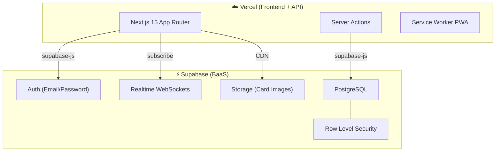

# 🃏 Copa Mental — Plan de Implementación

Web app PWA de torneos de juego de memoria con cartas temáticas. Los jugadores compiten para lograr la mayor racha de matches consecutivos. Incluye sistema de tickets, ranking en tiempo real, y panel de administración.

**Stack**: Next.js 15 (App Router) + Supabase + Vercel + PWA

---

## Mecánica del Juego (Confirmada ✅)

```mermaid
flowchart TD
    A["Jugador tiene tickets"] -->|Inicia partida| B["Tablero de cartas boca abajo"]
    B --> C["Voltea 2 cartas"]
    C -->|"Son iguales"| D["✅ +1 Racha — Cartas quedan volteadas"]
    C -->|"No son iguales"| E["❌ PIERDE — Racha se registra"]
    D -->|"¿Completó las rachas\nconfiguradas por admin?"| F{"¿Completó\nrachas?"}
    F -->|No| B
    F -->|Sí| G["🏆 ¡GANÓ! Racha máxima registrada"]
    E --> H["Se consume 1 ticket"]
    H -->|"¿Tiene más tickets?"| I{"¿Más tickets?"}
    I -->|Sí| J["Puede jugar de nuevo"]
    I -->|No| K["No puede seguir jugando"]
    J --> B
    G --> L["Racha se suma al ranking"]
    E --> L

    style D fill:#1a4d1a,stroke:#39ff14
    style E fill:#4d1a1a,stroke:#ff3860
    style G fill:#1a3d4d,stroke:#00f5ff
```



### Reglas clave:
1. **1 ticket = 1 sesión de juego** dentro del torneo activo
2. El jugador voltea pares de cartas buscando matches
3. **Match exitoso** (+1 racha): las cartas quedan volteadas, sigue jugando
4. **Fallo** (cartas diferentes): **pierde la partida**, se consume 1 ticket, racha se registra
5. Si tiene más tickets → puede jugar de nuevo
6. Si NO tiene más tickets → no puede seguir jugando
7. **Mejor racha** (mayor cantidad de matches consecutivos) se registra en el **ranking**
8. El admin configura **cuántas rachas** (pares a encontrar) tiene cada torneo
9. Si el jugador alcanza el objetivo de rachas configurado → **gana** sin perder ticket y su racha perfecta se registra

---

## Imágenes de Cartas (Generadas con IA 🎨)

Se generarán **20 pares únicos por temática** = **60 imágenes totales**:

| Temática | 20 Diseños | Estilo visual |
|----------|-----------|---------------|
| **Tecnología** | Laptop, Smartphone, CPU, Router, Robot, Satélite, Drone, VR Headset, Smartwatch, Servidor, Chip, Antena, Cámara, Impresora 3D, Código, Cohete, Holograma, IA Brain, Circuito, USB | Neón azul eléctrico sobre fondo oscuro, estilo cyberpunk |
| **Naturaleza** | Hoja, Flor de loto, Roble, Montaña, Río, Sol, Mariposa, Nube, Cascada, Cactus, Coral, Musgo, Gota de agua, Luna, Volcán, Arcoíris, Estrella, Cristal, Hongo, Pluma | Verdes esmeralda y tonos tierra, estilo botánico |
| **Animales** | León, Águila, Delfín, Zorro, Búho, Lobo, Tortuga, Colibrí, Tigre, Oso, Serpiente, Caballo, Panda, Elefante, Tiburón, Mariposa, Camaleón, Pingüino, Pulpo, Fénix | Ilustración vibrante sobre fondo oscuro, detalles neón |

> Cada imagen será cuadrada (512×512), con fondo oscuro (#0a0a0f) para integrarse al tema de la app.

---

## Arquitectura General



---

## Estructura del Proyecto

```
torneoMental/
├── public/
│   ├── manifest.json              # PWA manifest
│   ├── icons/                     # PWA icons
│   │   ├── icon-192.png
│   │   ├── icon-512.png
│   │   └── apple-touch-icon.png
│   └── cards/                     # Card images (generated by AI)
│       ├── tecnologia/            # 20 images
│       ├── naturaleza/            # 20 images
│       └── animales/              # 20 images
├── src/
│   ├── app/
│   │   ├── layout.jsx             # Root layout (PWA meta, fonts)
│   │   ├── page.jsx               # Landing → redirect
│   │   ├── globals.css            # Design system
│   │   ├── (auth)/
│   │   │   ├── login/page.jsx
│   │   │   └── registro/page.jsx
│   │   ├── (player)/
│   │   │   ├── layout.jsx         # Navbar inferior
│   │   │   ├── home/page.jsx
│   │   │   ├── jugar/page.jsx
│   │   │   ├── ranking/page.jsx
│   │   │   └── billetera/page.jsx
│   │   └── (admin)/
│   │       ├── layout.jsx         # Sidebar admin
│   │       └── admin/
│   │           ├── page.jsx       # Dashboard
│   │           ├── torneos/
│   │           │   ├── page.jsx
│   │           │   └── crear/page.jsx
│   │           ├── usuarios/page.jsx
│   │           └── tickets/page.jsx
│   ├── components/
│   │   ├── ui/                    # Button, Modal, Badge, Input, Spinner
│   │   ├── game/                  # Card, CardGrid, StreakDisplay, GameStats, GameResultModal
│   │   ├── layout/                # Navbar, AdminSidebar, PWAInstallPrompt
│   │   ├── ranking/               # RankingTable, PlayerCard
│   │   └── shared/                # CountdownTimer, ProtectedRoute
│   ├── lib/
│   │   ├── supabase/
│   │   │   ├── client.js          # Browser client
│   │   │   ├── server.js          # Server client
│   │   │   └── middleware.js
│   │   ├── gameLogic.js
│   │   ├── cardThemes.js
│   │   └── constants.js
│   ├── hooks/
│   │   ├── useAuth.js
│   │   ├── useGame.js
│   │   ├── useCountdown.js
│   │   ├── useRealtime.js
│   │   └── usePWAInstall.js
│   ├── actions/                   # Server Actions
│   │   ├── auth.js
│   │   ├── tournaments.js
│   │   ├── tickets.js
│   │   ├── games.js
│   │   └── admin.js
│   └── middleware.js              # Auth redirects
├── supabase/
│   ├── migrations/
│   │   └── 001_initial_schema.sql
│   └── seed.sql
├── next.config.mjs
├── package.json
└── .env.local
```

---

## Base de Datos — PostgreSQL (Supabase)

```sql
-- profiles (extends auth.users)
CREATE TABLE public.profiles (
    id UUID PRIMARY KEY REFERENCES auth.users(id) ON DELETE CASCADE,
    nombre TEXT NOT NULL,
    apellido TEXT NOT NULL,
    email TEXT UNIQUE NOT NULL,
    whatsapp TEXT NOT NULL,
    cedula TEXT UNIQUE NOT NULL,
    role TEXT NOT NULL DEFAULT 'player' CHECK (role IN ('player', 'admin')),
    tickets_balance INTEGER NOT NULL DEFAULT 0,
    created_at TIMESTAMPTZ NOT NULL DEFAULT NOW()
);

-- tournaments
CREATE TABLE public.tournaments (
    id UUID PRIMARY KEY DEFAULT gen_random_uuid(),
    nombre TEXT NOT NULL,
    card_theme TEXT NOT NULL DEFAULT 'aleatorio'
        CHECK (card_theme IN ('tecnologia', 'naturaleza', 'animales', 'aleatorio')),
    card_count INTEGER NOT NULL DEFAULT 14
        CHECK (card_count >= 14 AND card_count % 2 = 0),
    streak_target INTEGER NOT NULL DEFAULT 5,
    start_time TIMESTAMPTZ NOT NULL,
    duration_minutes INTEGER NOT NULL DEFAULT 120,
    status TEXT NOT NULL DEFAULT 'borrador'
        CHECK (status IN ('borrador', 'programado', 'activo', 'finalizado')),
    prize_positions JSONB NOT NULL DEFAULT '[]',
    created_by UUID REFERENCES public.profiles(id),
    created_at TIMESTAMPTZ NOT NULL DEFAULT NOW()
);

-- tickets
CREATE TABLE public.tickets (
    id UUID PRIMARY KEY DEFAULT gen_random_uuid(),
    user_id UUID NOT NULL REFERENCES public.profiles(id),
    tournament_id UUID REFERENCES public.tournaments(id),
    quantity INTEGER NOT NULL DEFAULT 1,
    amount_usd DECIMAL(10,2) NOT NULL,
    payment_status TEXT NOT NULL DEFAULT 'pendiente'
        CHECK (payment_status IN ('pendiente', 'validando', 'aprobado', 'rechazado')),
    payment_reference TEXT,
    admin_note TEXT,
    approved_by UUID REFERENCES public.profiles(id),
    created_at TIMESTAMPTZ NOT NULL DEFAULT NOW(),
    updated_at TIMESTAMPTZ NOT NULL DEFAULT NOW()
);

-- games
CREATE TABLE public.games (
    id UUID PRIMARY KEY DEFAULT gen_random_uuid(),
    user_id UUID NOT NULL REFERENCES public.profiles(id),
    tournament_id UUID NOT NULL REFERENCES public.tournaments(id),
    ticket_id UUID REFERENCES public.tickets(id),
    best_streak INTEGER NOT NULL DEFAULT 0,
    total_pairs_matched INTEGER NOT NULL DEFAULT 0,
    total_time_ms INTEGER,
    status TEXT NOT NULL DEFAULT 'en_curso'
        CHECK (status IN ('en_curso', 'completado', 'perdido')),
    card_layout JSONB,
    started_at TIMESTAMPTZ NOT NULL DEFAULT NOW(),
    ended_at TIMESTAMPTZ
);

-- Ranking view
CREATE VIEW public.tournament_rankings AS
SELECT
    g.tournament_id,
    g.user_id,
    p.nombre,
    p.apellido,
    MAX(g.best_streak) as mejor_racha,
    MIN(g.total_time_ms) FILTER (WHERE g.best_streak = (
        SELECT MAX(g2.best_streak) FROM public.games g2
        WHERE g2.user_id = g.user_id AND g2.tournament_id = g.tournament_id
    )) as mejor_tiempo,
    COUNT(g.id) as partidas_jugadas,
    ROW_NUMBER() OVER (
        PARTITION BY g.tournament_id
        ORDER BY MAX(g.best_streak) DESC, MIN(g.total_time_ms) ASC
    ) as posicion
FROM public.games g
JOIN public.profiles p ON p.id = g.user_id
WHERE g.status IN ('completado', 'perdido')
GROUP BY g.tournament_id, g.user_id, p.nombre, p.apellido;

-- Auto-create profile on signup
CREATE OR REPLACE FUNCTION public.handle_new_user()
RETURNS TRIGGER AS $$
BEGIN
  INSERT INTO public.profiles (id, nombre, apellido, email, whatsapp, cedula)
  VALUES (
    NEW.id,
    NEW.raw_user_meta_data->>'nombre',
    NEW.raw_user_meta_data->>'apellido',
    NEW.email,
    NEW.raw_user_meta_data->>'whatsapp',
    NEW.raw_user_meta_data->>'cedula'
  );
  RETURN NEW;
END;
$$ LANGUAGE plpgsql SECURITY DEFINER;

CREATE TRIGGER on_auth_user_created
  AFTER INSERT ON auth.users
  FOR EACH ROW EXECUTE FUNCTION public.handle_new_user();

-- RLS Policies
ALTER TABLE public.profiles ENABLE ROW LEVEL SECURITY;
ALTER TABLE public.tournaments ENABLE ROW LEVEL SECURITY;
ALTER TABLE public.tickets ENABLE ROW LEVEL SECURITY;
ALTER TABLE public.games ENABLE ROW LEVEL SECURITY;

-- Profiles: everyone reads, own user updates
CREATE POLICY "profiles_select" ON public.profiles FOR SELECT USING (true);
CREATE POLICY "profiles_update" ON public.profiles FOR UPDATE USING (auth.uid() = id);

-- Tournaments: everyone reads, admins write
CREATE POLICY "tournaments_select" ON public.tournaments FOR SELECT USING (true);
CREATE POLICY "tournaments_admin" ON public.tournaments FOR ALL USING (
    EXISTS (SELECT 1 FROM public.profiles WHERE id = auth.uid() AND role = 'admin')
);

-- Tickets: own user reads/creates, admins manage
CREATE POLICY "tickets_select" ON public.tickets FOR SELECT USING (
    auth.uid() = user_id OR
    EXISTS (SELECT 1 FROM public.profiles WHERE id = auth.uid() AND role = 'admin')
);
CREATE POLICY "tickets_insert" ON public.tickets FOR INSERT WITH CHECK (auth.uid() = user_id);
CREATE POLICY "tickets_admin_update" ON public.tickets FOR UPDATE USING (
    EXISTS (SELECT 1 FROM public.profiles WHERE id = auth.uid() AND role = 'admin')
);

-- Games: tournament games visible, own user manages
CREATE POLICY "games_select" ON public.games FOR SELECT USING (true);
CREATE POLICY "games_insert" ON public.games FOR INSERT WITH CHECK (auth.uid() = user_id);
CREATE POLICY "games_update" ON public.games FOR UPDATE USING (auth.uid() = user_id);
```

---

## PWA Configuration

**manifest.json:**
```json
{
  "name": "Copa Mental - Juego de Memoria",
  "short_name": "Copa Mental",
  "description": "Compite en torneos de memoria con cartas temáticas",
  "start_url": "/home",
  "display": "standalone",
  "orientation": "portrait",
  "background_color": "#0a0a0f",
  "theme_color": "#00f5ff",
  "icons": [
    { "src": "/icons/icon-192.png", "sizes": "192x192", "type": "image/png" },
    { "src": "/icons/icon-512.png", "sizes": "512x512", "type": "image/png", "purpose": "maskable any" }
  ]
}
```

**Capacidades:**
- ✅ Instalable en Android/iOS
- ✅ Pantalla completa sin barra del navegador
- ✅ Splash screen con tema oscuro
- ✅ Icono en home screen
- ✅ Cache offline del shell de la app
- ✅ Portrait lock

---

## Pantallas Detalladas

### 1. Login/Registro
- Tema oscuro con glassmorphism
- Login: email + contraseña
- Registro: nombre, apellido, email, whatsapp, cédula, contraseña ×2
- Validación en tiempo real
- Redirect por rol (player → /home, admin → /admin)

### 2. Home del Jugador
- Header: Badges "Tickets" y "Saldo" con glow
- Botón JUGAR grande con pulso neón
- Torneo activo con countdown ("INICIA EN" / "TERMINA EN")
- Compra de tickets (1 ticket = $1.00 USD)
- Navbar inferior: Home, Ranking, Billetera

### 3. Juego de Memoria
- Barra stats: Mejor racha | Posición | Tickets
- Racha actual en verde neón grande
- Zona de revelación (2 slots para cartas seleccionadas)
- Grid de cartas boca abajo (configurable, mín 14)
- Countdown del torneo
- Card flip animation 3D
- Feedback: "¡GANASTE!" (verde) / "PERDISTE" (rojo)

### 4. Modal Perdiste
- "Racha final: X" en rosa neón
- "Tu racha quedó registrada en el ranking"
- Botón naranja "Jugar de nuevo (tienes X)"
- Botón gris "Volver"

### 5. Ranking
- "TERMINA EN XX:XX:XX" cyan
- Tarjeta usuario: mejor racha + posición
- Top jugadores con premios
- Fila actual destacada con borde cyan + "(tú)"
- Actualización en tiempo real

### 6. Billetera
- Balance de tickets y saldo
- Historial con estados coloreados
- Formulario de compra

### 7. Admin Dashboard
- Stats: usuarios, torneos, tickets
- Accesos rápidos

### 8. Admin Torneos
- Crear/editar con todos los campos configurables
- Lista de torneos con estados

### 9. Admin Usuarios
- Tabla con búsqueda
- Contador total

### 10. Admin Tickets
- Solicitudes pendientes
- Aprobar/rechazar con cantidad auto-seleccionada

---

## Plan de Ejecución (6 Fases)

### Fase 1: Setup y Fundación ⚙️
1. Inicializar Next.js 15 con App Router
2. Configurar PWA (manifest, service worker, icons)
3. Crear sistema de diseño CSS completo
4. Configurar Supabase client (browser + server)
5. Generar imágenes de cartas con IA (60 imágenes)

### Fase 2: Auth y Navegación 🔐
6. Páginas Login y Registro con Supabase Auth
7. Middleware de auth (redirects por rol)
8. Layouts: Navbar inferior (player), Sidebar (admin)
9. Protección de rutas

### Fase 3: Home y Tickets 🏠
10. Home del jugador con stats y botón jugar
11. Billetera con historial
12. Modals de confirmación
13. Admin: gestión de tickets

### Fase 4: Juego de Memoria 🎮
14. Card component con flip 3D
15. CardGrid con matching logic
16. GamePage con stats y countdown
17. Modals de resultado
18. Server Actions para partidas

### Fase 5: Torneos y Ranking 🏆
19. Admin: crear/editar torneos
20. Ranking con tabla de posiciones
21. Supabase Realtime para ranking en vivo
22. Admin: vista de usuarios

### Fase 6: PWA y Deploy 🚀
23. Service Worker y caching
24. PWAInstallPrompt
25. Testing completo
26. Deploy a Vercel + Supabase
27. Testing en móvil (instalación PWA)

---

## Variables de Entorno

```env
# .env.local
NEXT_PUBLIC_SUPABASE_URL=https://xxxxx.supabase.co
NEXT_PUBLIC_SUPABASE_ANON_KEY=eyJhbG...
SUPABASE_SERVICE_ROLE_KEY=eyJhbG...
NEXT_PUBLIC_APP_URL=https://torneomental.vercel.app
```

---

## Verification Plan

### Build & Lint
```bash
npm run build    # Compila sin errores
npm run lint     # Sin warnings
```

### PWA (Lighthouse)
| Métrica | Target |
|---------|--------|
| Performance | > 90 |
| PWA | ✅ Installable |
| Accessibility | > 90 |

### Manual Testing
1. Instalar PWA en teléfono
2. Flujo completo: registro → compra ticket → jugar → ranking
3. Admin: crear torneo → aprobar tickets → ver ranking
4. Ranking en tiempo real entre 2 navegadores
5. Countdown sincronizado
